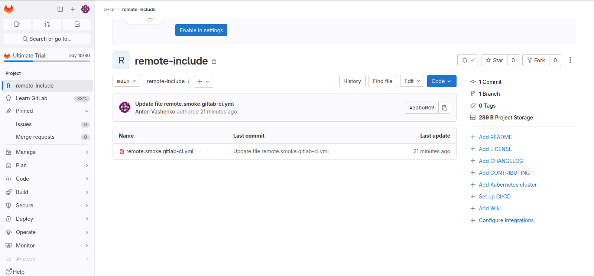
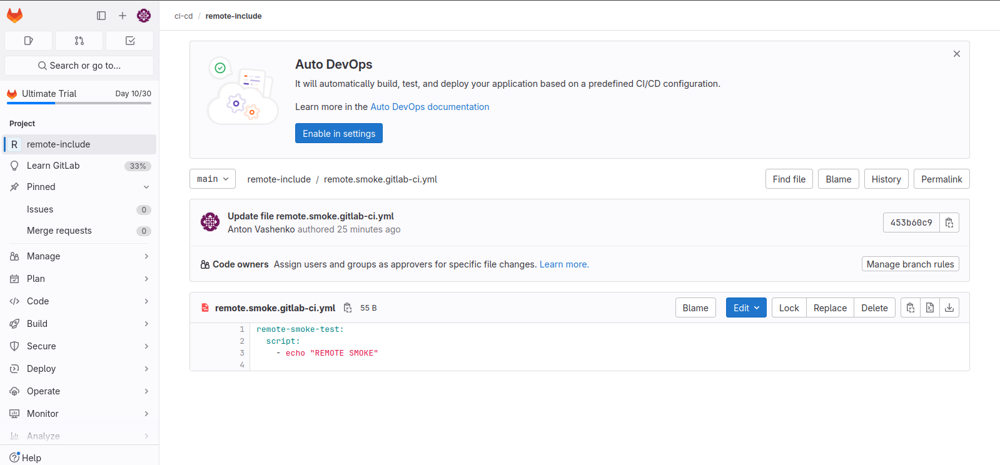
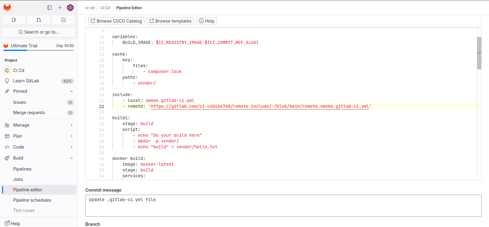
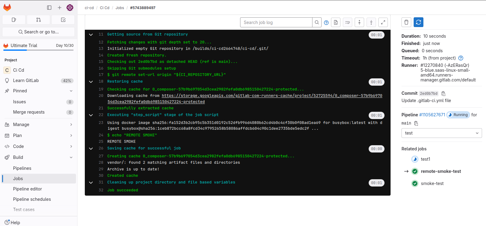

Создала файл с тестовой job в локальном репозитории. Создала новый проект и в нем файл с еще одной тестовой job.

Указала в pipeline первого проекта include.

Результат локальной тестовой job.

Результат удаленной тестовой job.
